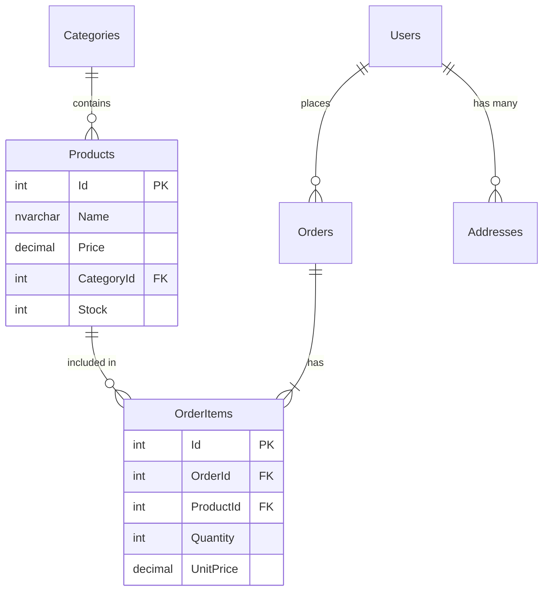

# 🏗️ BUỔI 3: DATABASE DESIGN & MODELING
## Xây dựng "nền móng" vững chắc cho hệ thống quy mô lớn

**Speaker:** Senior SQL Server Engineer / Technical Instructor
**Mục tiêu:** Nắm vững nghệ thuật thiết kế DB từ mức tư duy đến thực thi vật lý.

---

# 🕒 AGENDA
1. **The Design Lifecycle:** 4 bước từ ý tưởng đến script.
2. **Deep Dive Relationships:** 1-1, 1-N, N-N (Junction tables).
3. **Normalization Mastery:** 1NF, 2NF, 3NF với ví dụ thực tế.
4. **Primary Key Strategies:** Identity vs. UUID vs. ULID.
5. **Production Best Practices:** Metadata, Naming & Anti-patterns.
6. **Case Study:** Thiết kế hệ thống E-commerce thực chiến.

---

# 1. QUY TRÌNH THIẾT KẾ CHUYÊN NGHIỆP 📋

Không bao giờ mở Tool lên và `CREATE TABLE` ngay lập tức. Hãy đi theo luồng:

1.  **Requirement Analysis:** App làm gì? Cần lưu cái gì? (Ví dụ: Khách hàng cần lưu lịch sử đổi trả hàng).
2.  **Conceptual Design (ERD):** Vẽ các "khối" thực thể và nối chúng lại. Chưa cần quan tâm kiểu dữ liệu.
3.  **Logical Design:** Áp dụng các quy tắc chuẩn hóa (Normalization). Xác định các khóa ngoại (FK).
4.  **Physical Design:** Chọn SQL Server, chọn kiểu dữ liệu (INT hay BIGINT), đặt Index, cấu hình Partition.

---

# 2. CHI TIẾT VỀ CÁC MỐI QUAN HỆ 🔗

### A. Một - Nhiều (1-N) - "Mẹ và Con"
*   **Ví dụ:** 1 Phòng ban (`Department`) có nhiều Nhân viên (`Employee`).
*   **Cách làm:** Đặt `DepartmentId` (FK) vào bảng `Employee`.
*   **Best Practice:** Luôn đặt Index cho cột FK này để tăng tốc độ JOIN.

### B. Nhiều - Nhiều (N-N) - "Cầu nối"
*   **Ví dụ:** 1 Bài viết (`Post`) có nhiều Thẻ (`Tag`), 1 Thẻ nằm trong nhiều Bài viết.
*   **Cách làm:** Bắt buộc dùng bảng trung gian (Junction/Mapping Table).
*   **Cấu trúc bảng `PostTags`:** `PostId`, `TagId`.

### C. Một - Một (1-1) - "Phân tách dữ liệu"
*   **Ví dụ:** Bảng `Users` và bảng `UserSettings` hoặc `UserBiometrics`.
*   **Tại sao dùng:** Khi một số cột quá lớn (như Blob ảnh) hoặc ít khi dùng tới, ta tách ra để bảng chính nhẹ hơn (Vertical Partitioning).

---

# 3. CHUẨN HÓA (NORMALIZATION) - VÍ DỤ THỰC TẾ 🧹

### 🔴 Chưa chuẩn hóa (Dữ liệu rác)
| OrderID | CustomerName | Products | Total |
| :--- | :--- | :--- | :--- |
| 1 | Nguyễn Văn A | iPhone 15, Ốp lưng | 30.000.000 |

### 🟢 Chuẩn hóa 1NF (Atomic Values)
*   *Quy tắc:* Mỗi ô chỉ chứa 1 giá trị. Không lưu danh sách sản phẩm bằng dấu phẩy.
*   *Kết quả:* Tách mỗi sản phẩm thành 1 dòng.

### 🟢 Chuẩn hóa 2NF (Partial Dependency)
*   *Quy tắc:* Tách các dữ liệu không liên quan trực tiếp đến Khóa chính ra bảng riêng.
*   *Kết quả:* Tách thông tin `CustomerName` ra bảng `Customers`. Nếu A đổi tên, ta chỉ cần sửa 1 chỗ.

### 🟢 Chuẩn hóa 3NF (Transitive Dependency)
*   *Quy tắc:* Không phụ thuộc bắc cầu.
*   *Ví dụ:* Đừng lưu `ProvinceName` vào bảng `Orders` nếu đã có `ProvinceId`. Hãy lưu ở bảng `Provinces`.

---

# 4. CHIẾN LƯỢC CHỌN PRIMARY KEY (PK) 🔑

| Loại PK | Ưu điểm | Nhược điểm | Khi nào dùng? |
| :--- | :--- | :--- | :--- |
| **INT Identity** | Cực nhẹ (4 byte), tự tăng, Index nhanh. | Dễ bị đoán (Insecure), khó merge dữ liệu. | Hệ thống nội bộ, bảng danh mục. |
| **UUID/GUID** | Duy nhất toàn cầu, khó đoán. | Nặng (16 byte), gây phân mảnh Index cực nặng. | Hệ thống phân tán, Microservices. |
| **ULID/Sequential UUID** | Vừa duy nhất, vừa có thứ tự thời gian. | Phức tạp hơn một chút để tạo. | **Khuyên dùng** cho hệ thống lớn hiện đại. |

---

# 5. PRODUCTION BEST PRACTICES 🚀

### 💎 Metadata Columns (Cột "phải có")
Bất kỳ bảng nào trong Production cũng nên có 4 cột này:
1.  `CreatedAt`: DATETIMEOFFSET - Biết bản ghi tạo lúc nào.
2.  `CreatedBy`: NVARCHAR(100) - Ai là người tạo.
3.  `UpdatedAt`: DATETIMEOFFSET - Lần cuối chỉnh sửa.
4.  `IsDeleted`: BIT (Default 0) - Dùng cho **Soft Delete**.

### 📛 Naming Convention
*   **Tên bảng:** Viết hoa chữ cái đầu (PascalCase), dùng số nhiều: `Orders`, `OrderDetails`.
*   **Khóa chính:** Luôn là `Id`.
*   **Khóa ngoại:** `TableName + Id` (Ví dụ: `CustomerId`).
*   **Prefix:** Đừng dùng `tbl_` hay `sp_`. SQL Server đã tự hiểu rồi.

---

# 6. ANTI-PATTERNS (NHỮNG SAI LẦM CHẾT NGƯỜI) ❌

1.  **M-V-P (Massive Variable Columns):** Tạo cột `Attr1`, `Attr2`, `Attr3`... để dự phòng. => Hãy dùng JSON column hoặc EAV model.
2.  **Lưu mật khẩu dạng Plain Text:** Luôn lưu Hash (Bcrypt/Argon2).
3.  **Thiếu Foreign Key:** Nghĩ rằng "Code sẽ check rồi". => Không, DB phải là lớp bảo vệ cuối cùng. Dữ liệu sẽ mồ côi (Orphan Data) nếu thiếu FK.

---

# 7. CASE STUDY: THIẾT KẾ E-COMMERCE (THỰC CHIẾN) 🛒

**Yêu cầu:** Lưu Sản phẩm, Danh mục, Đơn hàng, Khách hàng.

### Production Insight cho Case Study này:
*   **Lưu giá ở `OrderItems`:** Tại sao? Vì giá sản phẩm ở bảng `Products` sẽ thay đổi theo thời gian. Đơn hàng đã chốt thì giá phải "đóng băng" tại thời điểm đó.
*   **Audit Log:** Tạo một bảng `OrderHistory` để lưu lại mỗi khi trạng thái đơn hàng đổi từ `Pending` -> `Shipping` -> `Delivered`.

---

# 📝 BÀI TẬP VỀ NHÀ
Bạn hãy thiết kế bảng cho hệ thống **Đặt vé xem phim trực tuyến**:
1.  Quản lý Rạp, Phòng chiếu, Ghế.
2.  Quản lý Phim, Suất chiếu.
3.  Quản lý Vé (Vé phải gắn với 1 ghế cụ thể tại 1 suất chiếu nhất định).

*Yêu cầu: Xác định rõ PK, FK và các cột Metadata.*

---
*Senior SQL Instructor - Keep your database clean, keep your mind clear.*
